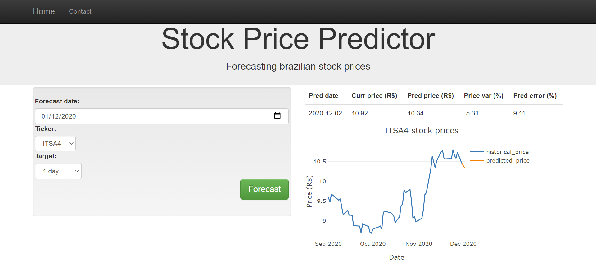

# Stock Prices Predictor Project
An initial approach to predict brazilian stock prices
### Table of Contents

1. [Installation and Instructions](#installation)
2. [Project Motivation](#motivation)
3. [File Descriptions](#files)
4. [Results](#results)
5. [Licensing, Authors, and Acknowledgements](#licensing)

## Installation and Instructions 

All aditional python libraries to run this project's scripts are in *requirements.txt*. The code should run in Python versions 3.*.

1. To install all dependences, run in comand line: 
          `pip install -r requirements.txt`

2. To run *project_report.ipynb* is necessary to install jupyter notebook, with the following command: 
    `pip install jupyter notebook`

3. Run the following command in the project's root directory to run web app: 
    `python app/start.py`

4. Go to http://localhost:3001/. It can take some time to start, because the first step is reading data from API.

## Project Motivation

For this project, I was interested to study more about stock market and time series. Moreover, I was eager to know
which kind of features I will use and check how well I will predict stocks in a first approach. So the challenge is to predict adjusted close
stock price (historically fixed price after splits, dividends and other events) for different stocks and future days.

All data are from [Yahoo Finance](https://finance.yahoo.com/) and extracted by [yahooquery](https://pypi.org/project/yahooquery/) API. 

## File Descriptions 

1. File structure of the project:

<pre>
<code>
.
|-- app
|   |-- static
|   |   | styles.css # pages styling 
|   |-- templates
|   |   |-- master.html  # main page of web app
|   |   |-- predict.html # web page for iteratively query predict results
|   |   |-- query.html # web page for query in first time for predict results
|   |-- start.py  # flask file that runs app
|-- data
|-- docs
|   |-- imgs
|   |   |-- homepage.PNG # picture for homepage web app
|   |   |-- query.PNG # picture for query page
|   |   |-- result.PNG # picture for result page
|-- models 
|-- pkgs
|   |-- feat_metrics #  package for create features
|   |   |-- __init__.py # package init
|   |   |-- feat_metrics.py # module containing metric calculation functions
|   |-- move_data #  package for move data
|   |   |-- __init__.py # package init
|   |   |-- move_data.py # module containing data moving functions
|   |-- process_modules # package for run pipeline functions
|   |   |-- __init__.py # package init
|   |   |-- load_data.py # module containg functions with all pipeline to read data from API and save it in db
|   |   |-- train_models.py # module containg functions with pipelines to prep datasets, train models and score results
|   |-- setup.py # package setup
|-- project_report.ipynb # analysis and discussions about the problem
|-- LICENSE 
|-- README.md
|-- requirements.txt # dependencies
</code>
</pre>

2. `data/Stocks.db` will be created after start app with 1 table:
- *stocks* - historical stock prices read from API

2.1 For now, it is loading only 9 tickers from API:
- ^BVSP (IBOVESPA - market index)
- ITSA4 (Itaúsa - Holding with Itau, Havaianas, Duratex and other brands)
- MGLU3 (Magazine Luiza - one of the biggest retail company in Brazil)
- VVAR3 (Via Varejo - another big retail company in Brazil)
- WEGE3 (WEG - big company for industrial and energetic solutions)
- MDIA3 (MediaCo - big company for food sector)
- LREN3 (Lojas Renner - large clothing retail store)
- ITUB3 (Itau - biggest Latim America private bank) 
- EGIE3 (Engie Brasil Energia - Big private company in electrical sector)

3. `models/models.pkl` will be created after choose tickers and train period to fit the model

3.1 Target times are predefined according forecast date (baseground date) choosen:
- `1_day` - 1 next workday after forecast date
- `1_week` - 5 workdays after forecast date
- `2_weeks` - 10 workdays after forecast date
- `1_month` - 22 workdays after forecast date

## Results 

1. Web app demonstration

1.1. Home app:

For app homepage is necessary to select tickers and train period to train models for all possibilities of ticker and target.

Obs.: Start date and end date should be days that market is open (workdays). And end date should be later than start date. In both cases, an error will occur
if these conditions are not met. In future project versions, it will include rules in frontend to avoid it.

1.2. Example of model's predict:

For this page, it is necessary to choose some parameters:
- Forecast date (baseground date for prediction)
- Stock ticker from trained subset stocks
- Target option

1.3. Plot results:

In this page, results are showed in right side:
- Pred date - future date that was made a prediction
- Curr price - current stock price in forecast date
- Pred price - price predicted for pred date
- Price var - price variation from forecast date to pred date in percentage
- Pred error - MAE error calculated for validation set during train period in percentage of pred price

A plot is showed to help to visualize the results.

It is possible to run another forecasts changing parameters explaned in section 2.

2. Features used to train the model with different windows:
- SMA stock price for last 7, 14, 36, 73 and 146 workdays
- Momentum stock price for last 36 workdays
- SMA Momentum for last 7, 36 and 73 workdays (momentum fixed in 36)
- SMA ^BVSP for last 73 workdays
- Volatility stock price for last 73 workdays
- Volatility ^BVSP for last 73 workdays
- Beta between stock price and ^BVSP for last 73 workdays
- EMA stock price for last 7, 14, 36, 73 and 146 workdays
- Last stock price

For more informations see *report_project.ipynb*

3. Modeling challeges:

First, to build features for this project it was necessary a lot of market knowlodge. This information was provided by Machine Learning for Trading, Tucker Balch (Georgia Tech and Udacity). 

Second, to create features in a time series problem can be a bit complex due to past periods window that these features can have access.

Finally, patterns in stock market changes a lot. It is hard to predict future in an environment so dynamic. The models results can be found in *project_report.ipynb*, but they are not great. Some models just keep safe to avoid a large absolute error and others copy past patterns. Some models really try to forecast a trend, but they are still making a lot of mistakes. However, this project is relevant to have a start point and test new hypothesis to tackle the problem.

4. Future work:

- Test new metrics to fit models instead of MAE, they can start to take more choices
- Use new features based in Fundamental analysis and apply text mining in social media to try to catch market trends
- Test new types of models, specific to time series
- Improve frontend with more views and improve UX
- Increase stock options to train models and implement a recursive forecast model to be possible choose a larger range of targets

## Licensing, Authors, Acknowledgements 

All data credit is from Yahoo Finance and data extraction from yahooquery. Otherwise, use the code as you wish. 
